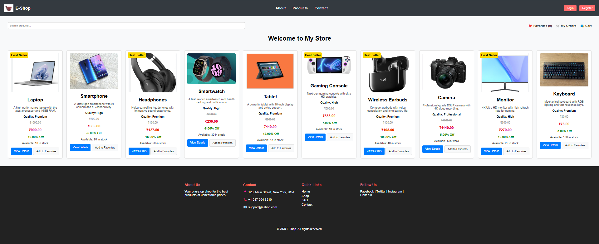

# Flask_Ecommerce 🚀



A modern e-commerce web application built with Flask, showcasing essential web development skills using Python, HTML, CSS,JavaScript and MySQL.

---

## 🔍 Overview

Flask_Ecommerce is a lightweight, micro web framework project that demonstrates the core principles of web development. It features user authentication, dynamic product listings, a shopping cart, and secure payment processing using Razorpay. The project emphasizes clean code, modular design, and responsive UI.

---

## 🌟 Features

- **User Authentication:**  
  🔑 Secure registration, login, password reset, and OTP verification using Flask-Mail and itsdangerous.

- **Product Management:**  
  🛍️ Display detailed product information including images, descriptions, pricing, and reviews.

- **Shopping Cart & Orders:**  
  🛒 Add products to a cart, review order summaries, and complete purchases with order tracking.

- **Payment Processing:**  
  💳 Integration with Razorpay for seamless payment, including dynamic payment redirection and verification.

- **UI Design:**  
  📱 Built using HTML, CSS

- **Dynamic Routing & Templating:**  
  🔄 Utilizes Flask's routing and Jinja2 templating engine for dynamic content rendering.

- **Data Management:**  
  📂 Performs file operations, regular expressions for text processing, and handles essential date and time functions.

---

## 🛠️ Tech Stack

- **Backend:** Python, Flask, MySQL, JavaScript
- **Frontend:** HTML, CSS
- **Tools & Libraries:** Flask-Mail, Razorpay, bcrypt, platformdirs, jaraco.text, itsdangerous, flask

---

## 🛠️ Requirements

Ensure you have Python installed, then install the following dependencies using the provided `requirements.txt` file (or install them manually):

- **Flask** – For building the web application.
- **Flask-Mail** – For sending emails (e.g., OTP, password reset).
- **itsdangerous** – For generating secure tokens.
- **razorpay** – For handling payment processing.
- **bcrypt** – For hashing passwords.
- **mysql-connector-python** – For connecting to the MySQL database.
- **jaraco.text** – Utility library used by Razorpay.
- **platformdirs** – Helps determine platform-specific directories.

## 🚀 Installation

1. **Clone the Repository:**
   ```bash
   git clone https://github.com/yourusername/Flask_Ecommerce.git
   cd Flask_Ecommerce
   ```
2. **Set Up Virtual Environment**
Activate the virtual environment before running the app.
- Windows
  ```
  venv\Scripts\activate
  ```
- Mac/Linux
  ```
  source venv/bin/activate
  ```
3. **Set Up the Database**
- Run the database.sql script on your MySQL server to create the necessary database and tables.

4. **Run the Application**
   - python app.py
5. **Access the App**
   - Open your browser and navigate to http://127.0.0.1:6002/ (or the configured port).

## 📁 Project Structure
```
Flask_Ecommerce/
├── app.py                      # Main Flask application
├── database.sql                # SQL script for database schema
├── requirements.txt            # Python package dependencies
├── venv/                       # Virtual environment (activate before running)
├── static/
│   ├── css/                    # Custom CSS files (e.g., style.css, dashboard.css, etc.)
│   └── images/                 # Product images and logos
└── templates/                  # HTML templates (base.html, login.html, register.html, etc.)
```

## 🎯 Usage
- Explore Products: Browse through product listings with detailed views and customer reviews.
- Shopping Experience: Add products to your cart, proceed to checkout, and make payments using Razorpay.
- User Account Management: Register, login, reset your password, and verify your account via OTP.

## 🤝 Contributing
Contributions are welcome! If you have suggestions or improvements, please fork the repository and create a pull request. For significant changes, open an issue first to discuss your ideas.

Happy coding! 😊
